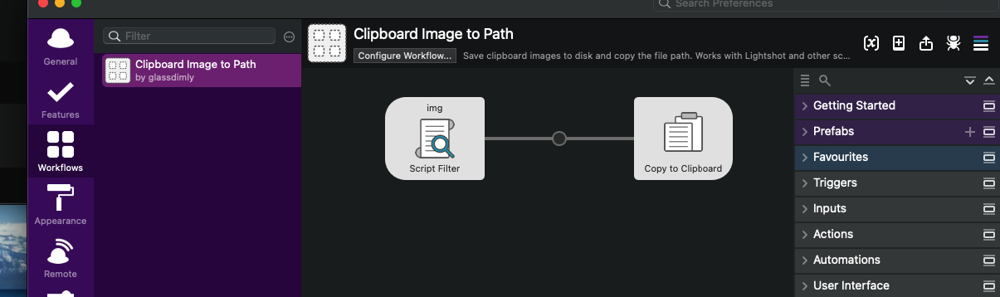
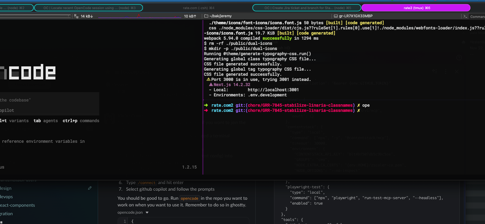

# Clipboard Image to Path — Alfred Workflow

Save clipboard images as PNG files and copy the file path to your clipboard. Designed for tools like [OpenCode](https://opencode.ai), Cursor, or any app where you need to reference images by file path.

Works with Lightshot, macOS screenshots, browser copies, GIMP, and anything else that puts image data on the clipboard.

## Requirements

- macOS
- [Alfred 4 or 5](https://www.alfredapp.com/) with Powerpack
- Clipboard History enabled in Alfred (Preferences > Features > Clipboard History > Keep Images)

## Install

```sh
git clone https://github.com/glassdimly/alfred-clipboard-image-text-path-copy.git
cd alfred-clipboard-image-text-path-copy
./install.sh
```

To update, `git pull` and run `./install.sh` again.

## Usage

1. Copy an image to the clipboard (screenshot tool, browser, etc.)
2. Open Alfred, type `img`
3. **Current clipboard** image appears at the top — select it and press Enter
4. The file path (e.g. `/Users/you/.config/alfred/clipboard-image/images/clipboard-1234567890.png`) is copied to your clipboard
5. Paste the path wherever you need it

Below the current clipboard item, you'll also see images from Alfred's clipboard history with relative timestamps ("2 min ago", "yesterday", etc.).





## Configuration

### Image Retention Period

By default, saved images are automatically cleaned up after **7 days**. You can change this:

- **Alfred 5**: Click "Configure Workflow..." in Alfred Preferences and set "Image Retention (days)"
- **Alfred 4**: Set the `cleanup_days` environment variable in the workflow's configuration (Alfred Preferences > Workflows > Clipboard Image to Path > the `[x]` icon)

Set to `0` to disable automatic cleanup entirely.

## How it works

- **Live clipboard capture**: Uses `osascript` to grab PNG data directly from the system pasteboard. This catches apps like Lightshot where Alfred's own clipboard history fails to persist the image data.
- **Alfred clipboard history**: Queries Alfred's `clipboard.alfdb` SQLite database for previously copied images and converts the stored TIFF files to PNG.
- **Auto-cleanup**: Images older than the configured retention period (default: 7 days) in `~/.config/alfred/clipboard-image/images/` are deleted automatically. See [Configuration](#configuration).
- **Caching**: Converted images use content-hash filenames to avoid duplicate conversions.

## Compatibility

This workflow supports both Alfred 4 and Alfred 5. The `info.plist` includes keys required by Alfred 5 (e.g. `version`, `readme`, `vitoclose`) which are safely ignored by Alfred 4.

The installer auto-creates the `workflows/` directory if it doesn't exist, which can happen on fresh Alfred 5 installations that haven't had any workflows installed yet.

## Files

| File | Purpose |
|---|---|
| `script_filter.sh` | Script Filter — queries clipboard, outputs Alfred JSON |
| `info.plist` | Alfred workflow definition |
| `install.sh` | Installer script |

## Uninstall

Delete the workflow from Alfred Preferences, then:

```sh
rm -rf ~/.config/alfred/clipboard-image
```

## Note

This workflow was AI-generated using [OpenCode](https://opencode.ai) with Claude.

## License

MIT
